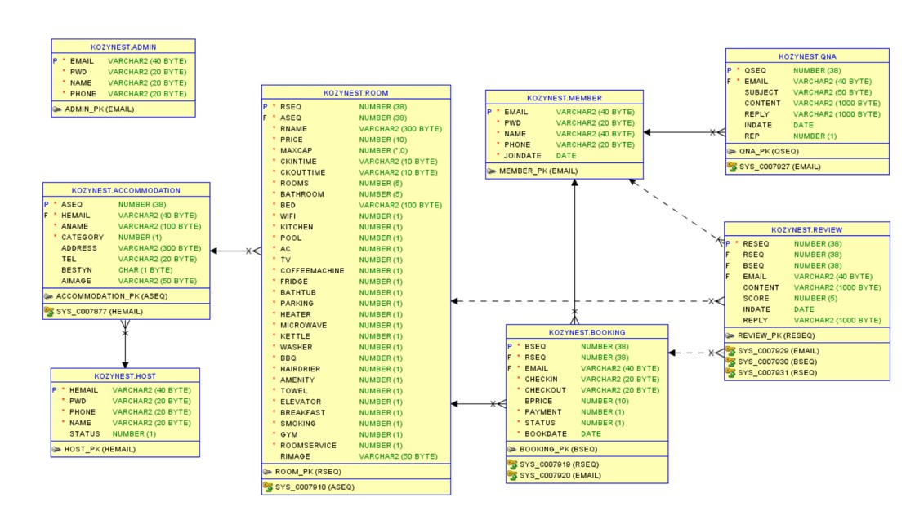
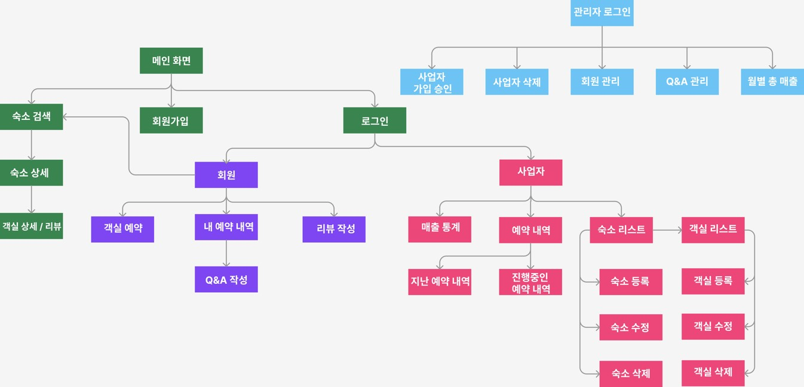

# 🏙️ KozyNest - 숙소예약 (Lodging Service)

프로젝트명: KozyNest - Korean Comfort Lodging

프로젝트 제작 기간: 2023.03.27 ~ 20223.04.12

### 🧳 프로젝트 개요 (Project Overview)

KozyNest 프로젝트의 목적은 백엔드 측면에 초점을 맞춘 숙박 웹 프로그램을 구축하는 것이었습니다. 프로젝트의 목표는 숙박 업주가 자신의 숙소를 등록하고 손님들이 이 숙소를 예약할 수 있는 완전히 기능이 구현된 웹사이트를 만드는 것이었습니다.

# 🏙️ 프로젝트 구성 및 설계

### 🧳 Database ERD

###  🧳 Site Map

### 🧳 사용된 기술 (Technologies Used)

**개발환경**

- Windows 10
- Eclipse IDE
- Oracle SQL Developer
- Github

**DB & WAS**
- Oracle
- Apache Tomcat 9.0

**백앤드**

- Spring MVC
- Spring AOP
- Java 11
- Oracle Database

**프론트앤드**

- HTML/CSS
- JavaScript
- Bootstrap
- JQuery
- Ajax
